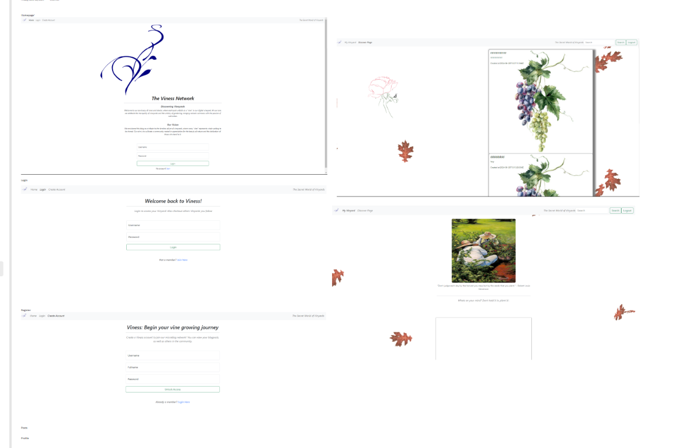

# Enjoy the Microblog Project and the MicroblogLite API!

Don't forget to read the [*MicroblogLite* API docs](http://microbloglite.us-east-2.elasticbeanstalk.com/docs) and experiment with the API in *Postman!*

Practice and experimentation provide experience, and experience provides confidence.

# Creating a Microblog for my Pluralsight Capstone

theme: Vineyard

ABout us: Discovering Vineyards
Welcome to our sanctuary of vines and stories, where each post unfolds as a "vine" in our digital vineyard. At our core, we celebrate the tranquility of vineyards and the artistry of gardening, merging nature's calmness with the passion of cultivation.

Our Vision
We envisioned this blog as a tribute to the timeless allure of vineyards, where every "vine" represents a tale waiting to be shared. Our aim is to cultivate a community rooted in appreciation for the beauty of nature and the dedication of those who tend to it.

